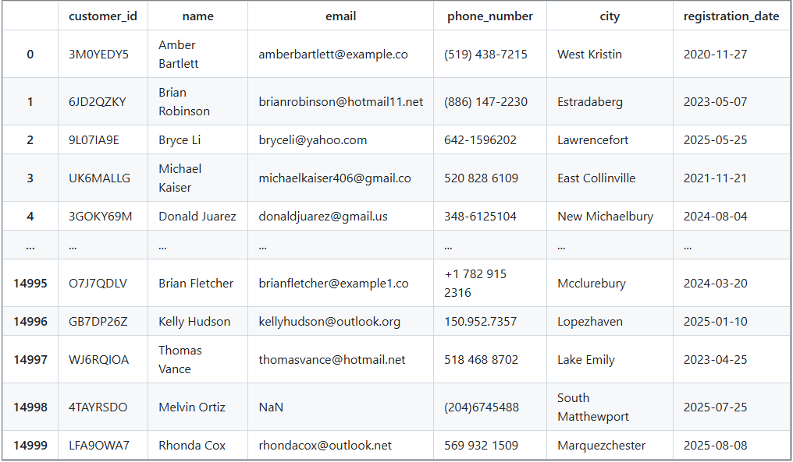
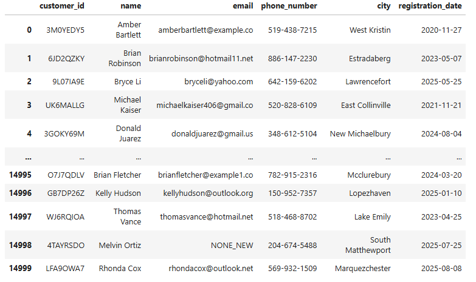

# Data Cleaning Automation with Python (pandas)

This project demonstrates how I help businesses clean, normalize, and prepare messy data files using Python and the **pandas** library.  

Messy CSVs and Excel exports are a common problem for small businesses, CRMs, and eCommerce tools.  
This tool **automates** the process, saving hours of manual work.

---

## 🚀 Features
- Remove duplicate records  
- Handle missing values (fill or drop)  
- Normalize names, emails, phone numbers, and city names  
- Standardize dates to `YYYY-MM-DD` format  
- Process **all CSV files in a folder** at once  
- Export cleaned datasets to a new folder  

---

## 📁 Project Workflow (WIP)
1. Place your messy CSV files inside the `raw_data/` folder.  
2. Run the script:
   ```bash
   python batch_clean_data.py

---

## Example:
Here is an before and after example of a 15K line CRM data set before cleansing: <br>

Before cleansing:



After cleansing:



## 💼 Use Cases

   - Clean messy CRM exports
   - Prepare data for analysis / reporting
   - Makes data easier to read

---

## 📊 Value 

   - Saves hours of manual spreadsheet cleanup allowing you to focus on optimizing your business
   - Prevents errors in analysis
   - Provides consistent, reliable data for decision-making

---

🔧 Tech Stack

   - Python 3.x
   - pandas
   - os (file handling)

